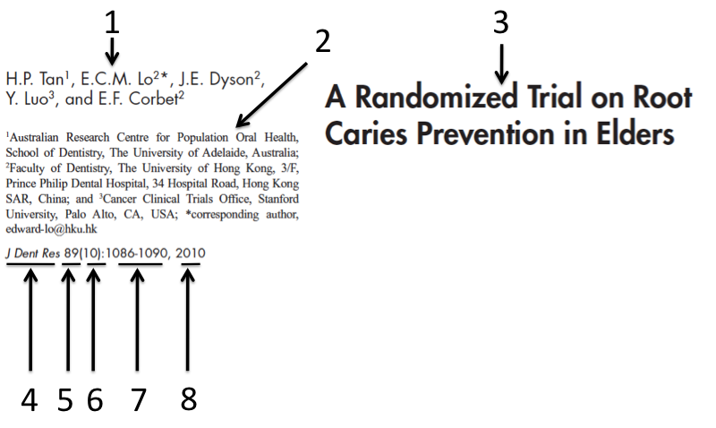

```{r global_options, include=FALSE} 
knitr::opts_chunk$set(fig.pos = 'H') #previene que se muevan las figuras
```

# Introducción a los métodos de investigación
 -  Es considerado el padre del método científico. Esta frase se refiere a _____________________
 - Indique las tres características de una buena teoría científica 
 - La característica principal del conocimiento científico es que es ___________________
 - El aporte de Ronald A. Fisher a la investigación biomédica consistió en ______________

## Ética
 - Explique los cuatro principios éticos básicos
 - El procedimiento formal para asegurar el cumplimiento del principio de autonomía es ____________
 - Si los resultados del estudio pudieran estar influidos por motivaciones financieras del investigador, estamos hablando de ___________
 - Indique si las siguientes preguntas son preguntas éticas
    a.  Debemos realizar un estudio en pueblos originarios para aplicarlo en personas caucásicas?
    a.  Existen diferencias en respuesta al medicamento X entre la raza caucásica y etiópea?
    a.  Existe menor prevalencia de periodontitis en personas orientales que occidentales?
    a.  Cuáles son las diferencias éticas entre realizar una investigación en Egipto y en Irak?
    a.  Cuál debe ser el precio de un nuevo medicamento?

# Búsqueda de información
 - Cuál de las siguientes búsquedas genera más ítems o resultados?
    a) Periodontal AND caries AND  systemic diseases
    b) (Periodontal OR caries) AND  systemic diseases
    c) (Periodontal NOT caries) AND  systemic diseases 
    d) (Periodontal OR caries OR  systemic diseases)
    e) (Periodontal OR caries NOT  systemic diseases)
 
 - Identifique las partes cada parte numeradas de figura \ref{referencias} y describa que significa el 5 y 6
 
 

 
 - Dentro de un artículo científico, la sección donde Ud. puede encontrar **ideas** para realizar una investigación, es ______________
 
 - Las secciones esenciales de un manuscrito científico son ______________, ____________, _________ y _______________
 
 - Al ingresar el siguiente texto en PubMed: 
 *Agressive Periodontitis/drug therapy[Mesh] AND (amoxicilin AND metronidazole) AND (blind&ast; AND random&ast;)*
	encontrará estudios principalmente de tipo: 
    a. descriptivos
    a. cohortes
    a. casos y controles
    a. cuasiexperimentales
    a. clínicos aleatorios

# Diseño de estudios
 - El tipo de investigación más cercano a establecer causalidad en humanos es _____________
 - Acerca de las enfermedades, el *Principio Epidemiológico* señala que:
    a) Las enfermedades se distribuyen al azar.
    b) Las enfermedades no se distribuyen aleatoriamente. 
    c) Siempre es necesario realizar un estudio epidemiológico.
    d) La población enferma siempre buscará un tratamiento.
    e) Las causas de las enfermedades son géneticas
 - Ud desea validar el Cariograma, un test que indica el riesgo de caries y estima la probabilidad del desarrollo de caries. El diseño apropiado para validarlo es:__________________
 
 - De acuerdo al siguiente material y método:  
 *Methods: MEDLINE, EMBASE and the Cochrane Library were searched through December 2009 to 	identify relevant randomised trials with blind outcome assessment and a minimum duration of 1 year. The 	search was later updated in MEDLINE and the Cochrane Library to March 19th, 2010. Risk of bias of the 	included trials was assessed. The primary outcome was the caries increment.* La pauta apropiada para analizar este estudio es  _____________
 
 -  Identifique a qué tipo de estudio corresponde el siguiente abstract (Pediatr Dent. 2010;32(2):134-40.) *PURPOSE: The aim of the present investigation was to compare the prevalence of taurodontism in the permanent mandibular first molars of nonsyndromic children with hypodontia and supernumerary teeth with age- and gender-matched controls. METHODS: The crown-body root ratios of the permanent first molars were determined from orthopantomograms of 83 children with hypodontia (> or =1 missing teeth) and 37 children with supernumerary teeth (> or =1 extra teeth) compared with normal case controls.*
 
 - Identifique a qué tipo de estudio corresponde el siguiente fragmento: \ *“The objective of this study was to assess whether there is a bi-directional relationship between periodontal status and diabetes. This study included 5,856 people without periodontal pockets of ≥ 4 mm at baseline. Relative risk was estimated for the 5-year incidence of periodontal pockets of ≥ 4 mm (CPI scores 3 and 4, with the CPI probe), in individuals with glycated hemoglobin (HbA1c) levels of ≥ 6.5% at baseline”*
 
## Muestreo
 - Usted realiza un estudio sobre prevalencia de caries en primeros molares en niños de 12 años, para ello pretende visitar todos los colegios de su comuna escogiendo a los alumnos número 5, 10 y 15 de la lista de curso de cada 7mo básico de los establecimientos visitados. Indique el el método de aleatorización.
 
 - Identifique el método de selección de la muestra utilizado en el siguiente estudio: \ *AIM: The objective of this study was to estimate the caries impact of providing training in infant feeding guidelines to workers at Brazilian public primary care clinics. In a cluster-randomized controlled trial (n = 20 clinics), health care workers either were trained in guidelines for infant nutrition, stressing healthful complementary feeding, or were assigned to a 'usual practices' control, which allowed for maternal counseling at practitioner discretion. Training occurred once; the amount of counseling provided to mothers was not assessed. Eligible pregnant women were enrolled to follow health outcomes in their children. Early childhood caries (ECC) was measured at age three years (n = 458 children).*

 - En un estudio aparece la siguiente frase: “el tamaño muestral es de 354 con una potencia estadística del 80%”. Explíque a que se refiere
 
 - En un estudio (J Dent Res. 2010 Oct;89(10):1086-90.)  se comparó la efectividad de 3 métodos de prevención de caries en pacientes adultos mayores institucionalizados y se obtuvieron los resultdos de la siguiente imagen.
 
 

Al respecto indique
 
   - Qué test estadístico sería el más apropiado de utilizar para analizar estos datos? 
   - Con los datos de la tabla, ¿cuál o cuáles son los métodos más efectivos para la reducción de caries o nuevas restauraciones al año 3?

## Análisis
 - Se realiza un estudio que mide la severidad de caries en COP(D)en adultos de tres estratos socioeconómicos  (ABC1, C2 y D), con 300 mediciones para ABC1 y B y 450 para C. La prueba estadística más indicada para el análisis de los datos sería ________________________________
 
 - El mismo estudio ahora compara la proporción de adultos libres de caries (COP(D) = 0) vs con caries (COP(D) > 0). La prueba estadística más indicada para el análisis de los datos sería ________________________________

- Cuál es la diferencia entre significancia clínica y significacia estadística? 


# Estudios observacionales de prevalencia
## Aspectos claves de los estudios de prevalencia

**Incidencia**
$$Tasa \;de \;Incidencia = \frac{N\acute{u}mero \; de \; casos\; \boldsymbol{nuevos}\;durante\; un \; per\acute{i}odo\;de\;tiempo}{Poblaci\acute{o}n\;en\;riesgo\;a\;la\;mitad\;del\;tiempo}$$
**Prevalencia**
$$Prevalencia \;puntual = \frac{N\acute{u}mero \; de \; casos\; durante\; un \; momento\;espec\acute{i}fico\;de\;tiempo}{Poblaci\acute{o}n\;en\;riesgo\;a\;la\;mitad\;del\;tiempo}$$
$$Prevalencia \;del\;per\acute{i}odo = \frac{N\acute{u}mero \; de \; casos\; durante\; un \; momento\;de\;tiempo}{Poblaci\acute{o}n\;en\;riesgo\;a\;la\;mitad\;del\;tiempo}$$
$$Prevalencia = {Incidencia}\; x\;{Duraci\acute{o}n}$$
$$Personas-año = {N\; de\; personas}\; x\;{Duraci\acute{o}n\;en\;años}$$

 - Usted desea realizar un estudio de prevalencia de estomatitis aftosa recidivante en niños de 6 años en Valdivia, realizando un examen bucal. El mejor lugar para la obtención de la muestra es _________________
 - La incidencia de un tipo de carcinoma oral en Valdivia es tres veces más alta en hombres que en mujeres, pero la prevalencia es casi la misma para ambos sexos. Explique esta situación. 
 


# Estudios observacionales analíticos
 - Indique y explique los criterios de causalidad de Hill

# Estudios clínicos controlados
 - El propósito del doble cegamiento o enmascaramiento en un estudio clínico tiene como propósito  ___________________


# Revisiones sistemáticas
 - Interprete los resultados del siguiente gráfico


  - Interprete los resultados del siguiente gráfico
  

 - Indique a qué corresponden los números de la siguiente figura


## Indique a qué tipo de estudio pueden corresponder los siguientes abstract


 This study aimed to describe a rare presentation of a Warthin tumor and discuss its etiology and differential diagnosis


    a. Reporte de Caso
    b. Serie de caso
    c. Descriptivo / Prevalencia 
    d. Analítico longitudinal de cohorte prospectivo / Cohorte / incidencia
    e. Analítico longitudinal de cohorte retrospectivo o histórico / Casos y controles
    f. Analítico Transversal / Cohorte transversal
    g. Experimental in vitro
    h. Experimental en animales 
    i. ECA (estudio clínico aleatorio)
    j. Revisión sistemática 

 The aim of this study was to evaluate tooth and periodontal damage in subjects wearing a tongue piercing (TP) in comparison to matched control subjects without tongue piercing. Members of the German Federal Armed Forces who had TP (group TP) and a matched control group (group C) volunteered to take part in the study
        a. Reporte de Caso
        b. Serie de caso
        c. Descriptivo / Prevalencia 
        d. Analítico longitudinal de cohorte prospectivo / Cohorte / incidencia
        e. Analítico longitudinal de cohorte retrospectivo o histórico / Casos y controles
        f. Analítico Transversal / Cohorte transversal
        g. Experimental in vitro
        h. Experimental en animales 
        i. ECA (estudio clínico aleatorio)
        j. Revisión sistemática 

In the present study, cases of ameloblastomas and dentigerous cysts derived from the records of all the hospital pathology departments and private pathology practices on the Witwatersrand, were recorded for the 10-year period 1965--1974. The population at risk (1970 census) was 974,390 Whites and 1,567,280 Blacks. The annual incidence rates, standardized against the standard world population, for ameloblastomas per million population are 1.96, 1.20, 0.18 and 0.44 for Black males, females and White males, females, respectively
        a. Reporte de Caso
        b. Serie de caso
        c. Descriptivo / Prevalencia 
        d. Analítico longitudinal de cohorte prospectivo / Cohorte / incidencia
        e. Analítico longitudinal de cohorte retrospectivo o histórico / Casos y controles
        f. Analítico Transversal / Cohorte transversal
        g. Experimental in vitro
        h. Experimental en animales 
        i. ECA (estudio clínico aleatorio)
        j. Revisión sistemática 


METHODS: A school-based study consisting of 251 children aged 2-10 years old attending three primary schools in Lagos State, Nigeria. Baseline and exit dental examinations were conducted. Study exit examination was conducted 3 years after the baseline. The deft and DMFT index was used to assess caries severity. The key outcome measure recorded in the study was the development of new cavities in any of the previously caries-free teeth. The presence or absence of caries was represented by the change in deft and or DMFT status.
STATISTICS: In the analyses, the incidence of new cavities was recorded at both the subject and tooth levels. Incidence rates for the development of new caries were calculated for all children who: were caries-free at recruitment had caries at recruitment were caries-free at recruitment but developed caries during follow up. Relative risk (RR) analysis was also computed for caries-risk estimation.
        a. Reporte de Caso
        b. Serie de caso
        c. Descriptivo / Prevalencia 
        d. Analítico longitudinal de cohorte prospectivo / Cohorte / incidencia
        e. Analítico longitudinal de cohorte retrospectivo o histórico / Casos y controles
        f. Analítico Transversal / Cohorte transversal
        g. Experimental in vitro
        h. Experimental en animales 
        i. ECA (estudio clínico aleatorio)
        j. Revisión sistemática 

The present study was performed in an attempt to assess the anesthetic efficacy of an intraoral mucoadhesive tablet of amitriptyline. The mucoadhesive tablet was randomly placed for 15 minutes on the buccal mucogingival tissue adjacent to the root of the upper lateral incisor, and a placebo was placed on the other side. A 27-gauge needle was inserted to touch the alveolar periosteum of the designated site. The pain intensity associated with the stimulation was evaluated every 5 minutes after removing the mucoadhesive tablet using a visual analog pain scale and pain rating scoring methods.
        a. Reporte de Caso
        b. Serie de caso
        c. Descriptivo / Prevalencia 
        d. Analítico longitudinal de cohorte prospectivo / Cohorte / incidencia
        e. Analítico longitudinal de cohorte retrospectivo o histórico / Casos y controles
        f. Analítico Transversal / Cohorte transversal
        g. Experimental in vitro
        h. Experimental en animales 
        i. ECA (estudio clínico aleatorio)
        j. Revisión sistemática 

The purpose of this study was to directly compare the incidence and magnitude of bacteremia of a 0.12% chlorhexidine pre-procedure rinse to the AHA and the ADA/AAOS recommended 2 g amoxicillin antibiotic prophylaxis during third molar extractions.
        a. Reporte de Caso
        b. Serie de caso
        c. Descriptivo / Prevalencia 
        d. Analítico longitudinal de cohorte prospectivo / Cohorte / incidencia
        e. Analítico longitudinal de cohorte retrospectivo o histórico / Casos y controles
        f. Analítico Transversal / Cohorte transversal
        g. Experimental in vitro
        h. Experimental en animales 
        i. ECA (estudio clínico aleatorio)
        j. Revisión sistemática 


To determine the effect of antibiotic prophylaxis on the development of infectious complications following tooth extractions the following electronic databases were searched: the Cochrane Oral Health Group's Trials Register (to 25 January 2012), the Cochrane Central Register of Controlled Trials (CENTRAL) (The Cochrane Library 2012, Issue 1), MEDLINE via OVID (1948 to 25 January 2012), EMBASE via OVID (1980 to 25 January 2012) and LILACS via BIREME (1982 to 25 January 2012). There were no restrictions regarding language or date of publication.
        a. Reporte de Caso
        b. Serie de caso
        c. Descriptivo / Prevalencia 
        d. Analítico longitudinal de cohorte prospectivo / Cohorte / incidencia
        e. Analítico longitudinal de cohorte retrospectivo o histórico / Casos y controles
        f. Analítico Transversal / Cohorte transversal
        g. Experimental in vitro
        h. Experimental en animales 
        i. ECA (estudio clínico aleatorio)
        j. Revisión sistemática 

 MATERIAL AND METHODS: The presence of gingival recession was scored (Yes or No) on plaster models of 100 orthodontic patients (cases) and 120 controls at the age of 12 (T12 ), 15 (T15 ), 18 (T18 ), and 21 (T21 ) years. In the treated group, T12 reflected the start of orthodontic treatment and T15 - the end of active treatment and the start of retention phase with bonded retainers. Independent t-tests, Fisher's exact tests and a fitted two-part "hurdle" model were used to identify the effect of orthodontic treatment/retention on recessions.
RESULTS: The proportion of subjects with recessions was consistently higher in cases than controls. Overall, the odds ratio for orthodontic patients as compared with controls to have recessions is 4.48 (p < 0.001; 95% CI: 2.61-7.70).
        a. Reporte de Caso
        b. Serie de caso
        c. Descriptivo / Prevalencia 
        d. Analítico longitudinal de cohorte prospectivo / Cohorte / incidencia
        e. Analítico longitudinal de cohorte retrospectivo o histórico / Casos y controles
        f. Analítico Transversal / Cohorte transversal
        g. Experimental in vitro
        h. Experimental en animales 
        i. ECA (estudio clínico aleatorio)
        j. Revisión sistemática 


One hundred and eighty Cariogram files were completed from patients aged ten to fifty-six years (mean: 23.28 years). Seven factors from the software were included from patient records to complete the Cariogram: caries experience, diet (content and frequency), stimulated salivary flow, hygiene index, related diseases and fluoride usage. The percentages of "chances of avoiding new lesions" (caries risk) were obtained from Cariogram, and the subjects were classified into five risk groups. Results were compared for each variable with ANOVA, and a correlation between caries and Cariogram variables was calculated by Pearson's correlation coefficient. A multivariate regression model was also used.
        a. Reporte de Caso
        b. Serie de caso
        c. Descriptivo / Prevalencia 
        d. Analítico longitudinal de cohorte prospectivo / Cohorte / incidencia
        e. Analítico longitudinal de cohorte retrospectivo o histórico / Casos y controles
        f. Analítico Transversal / Cohorte transversal
        g. Experimental in vitro
        h. Experimental en animales 
        i. ECA (estudio clínico aleatorio)
        j. Revisión sistemática 